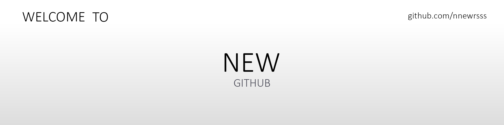

<!--Banner-->

<!--Profile Count Badge-->

  

## Hi there 👋 I am New

<!--Start Intro-->               

I am now a Computer Science Student of KING MONGKUT'S UNIVERSITY OF TECHNOLOGY NORTH BANGKOK.  

- ✨ Just Collage Student.
- 🌱 I’m currently learning many things, I believe that everyday is a learning opportunity.
- 💻 Visit my [Portfolio]() for more details about me.
<!--End Intro-->

#### Platforms

<!--
**nnewrsss/nnewrsss** is a ✨ _special_ ✨ repository because its `README.md` (this file) appears on your GitHub profile.

Here are some ideas to get you started:

- 🔭 I’m currently working on ...
- 🌱 I’m currently learning ...
- 👯 I’m looking to collaborate on ...
- 🤔 I’m looking for help with ...
- 💬 Ask me about ...
- 📫 How to reach me: ...
- 😄 Pronouns: ...
- ⚡ Fun fact: ...
-->
