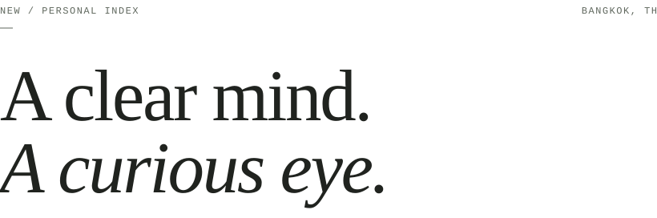
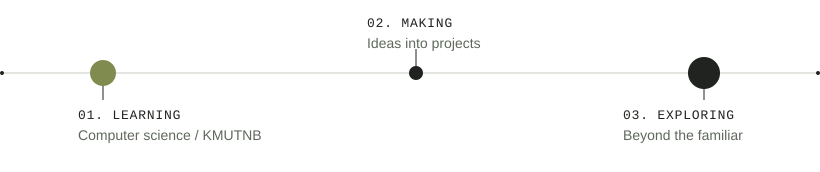
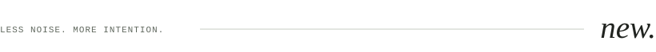

<picture>
  <source media="(prefers-color-scheme: dark) and (max-width: 600px)" srcset="./assets/editorial/header-mobile-dark.svg">
  <source media="(prefers-color-scheme: light) and (max-width: 600px)" srcset="./assets/editorial/header-mobile-light.svg">
  <source media="(prefers-color-scheme: dark)" srcset="./assets/editorial/header-dark.svg">
  <source media="(prefers-color-scheme: light)" srcset="./assets/editorial/header-light.svg">
  
</picture>

I’m New. Studying computer science at **KMUTNB**. 
Making things. Finding my own point of view.

 

<picture>
  <source media="(prefers-color-scheme: dark) and (max-width: 600px)" srcset="./assets/editorial/index-mobile-dark.svg">
  <source media="(prefers-color-scheme: light) and (max-width: 600px)" srcset="./assets/editorial/index-mobile-light.svg">
  <source media="(prefers-color-scheme: dark)" srcset="./assets/editorial/index-dark.svg">
  <source media="(prefers-color-scheme: light)" srcset="./assets/editorial/index-light.svg">
  
</picture>

 

<a href="https://github.com/nnewrsss?tab=repositories">
  <picture>
    <source media="(max-width: 600px)" srcset="./assets/editorial/work-mobile.svg">
    
  </picture>
</a>
<a href="https://www.instagram.com/nnewrs_/">
  <picture>
    <source media="(max-width: 600px)" srcset="./assets/editorial/social-mobile.svg">
    
  </picture>
</a>

 

<picture>
  <source media="(prefers-color-scheme: dark)" srcset="./assets/editorial/footer-dark.svg">
  <source media="(prefers-color-scheme: light)" srcset="./assets/editorial/footer-light.svg">
  
</picture>
